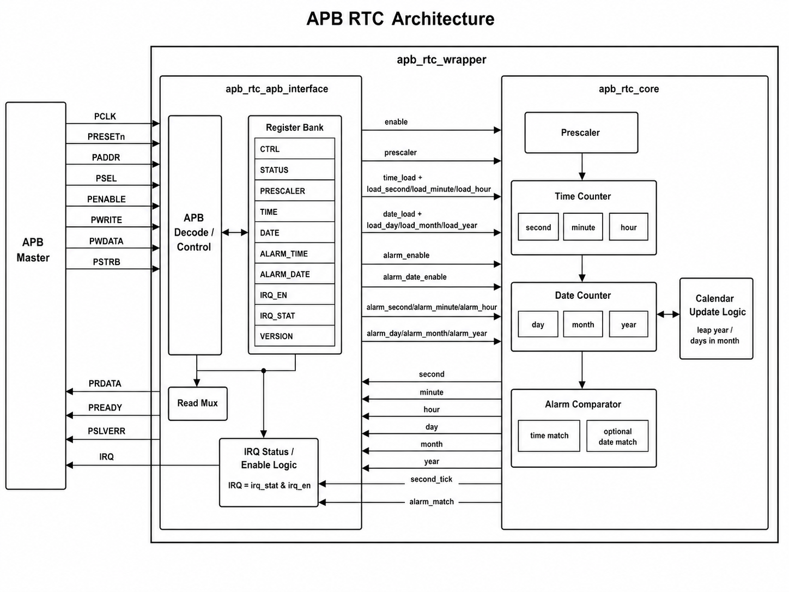

# APB RTC Core

A simple synthesizable Real-Time Clock written in SystemVerilog for FPGA and
ASIC integration. The IP provides a 32-bit APB register interface, binary
calendar counters, programmable one-second prescaler, alarm, and interrupts.

Detailed local documentation: [APB RTC IP Documentation](docs/index.html)

## Features

- Seconds, minutes, hours, day, month, and 12-bit year counters.
- Gregorian leap-year and month-length handling.
- Programmable prescaler derived from `PCLK`.
- Software load/read access for current time and date.
- Alarm with optional date matching.
- Sticky second-tick and alarm interrupt status with write-one-to-clear.
- UVM 1.2 verification environment following the `apb-i2c-core` structure.

## Architecture



```text
APB Master
    -> APB Register Interface
        -> Prescaler / 1-second Tick
        -> Time and Calendar Counters
        -> Alarm Comparator
        -> IRQ Status and Enable
```

## Register Map

| Address | Register | Description |
| --- | --- | --- |
| `0x00` | `CTRL` | Bit 0 enable, bit 1 alarm enable, bit 2 alarm-date enable |
| `0x04` | `STATUS` | Running, second-tick pending, alarm pending |
| `0x08` | `PRESCALER` | PCLK cycles minus one per RTC second |
| `0x0C` | `TIME` | Hour `[20:16]`, minute `[13:8]`, second `[5:0]` |
| `0x10` | `DATE` | Year `[27:16]`, month `[15:12]`, day `[8:4]` |
| `0x14` | `ALARM_TIME` | Alarm time in the same format as `TIME` |
| `0x18` | `ALARM_DATE` | Alarm date in the same format as `DATE` |
| `0x1C` | `IRQ_EN` | Bit 0 second tick, bit 1 alarm |
| `0x20` | `IRQ_STAT` | Sticky W1C interrupt status |
| `0x24` | `VERSION` | IP version |

Time and date fields use unsigned binary values, not BCD.

## Build and Verification

```sh
make lint
make compile
make run
make run UVM_TEST=apb_rtc_calendar_test
```

## Repository Structure

```text
inc/          Register macros and version
rtl/          Synthesizable RTC RTL
uvm/          UVM agent, sequences, tests, and scoreboard
filelist.f    RTL/UVM compile order
Makefile      Lint, compile, run, coverage, and clean targets
```

`apb_rtc_wrapper` is the top-level module. Reset initializes the calendar to
`2000-01-01 00:00:00` and leaves the RTC disabled. For time retention during a
main-power loss, integrate the counter state with an always-on power domain or
retention registers at SoC level.
